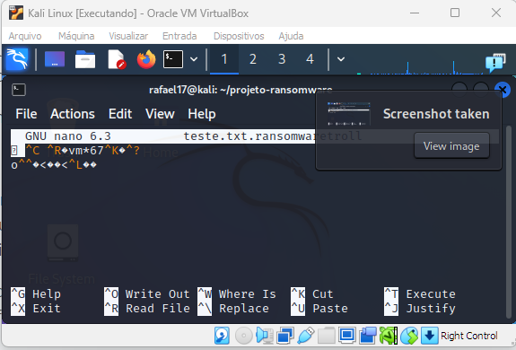
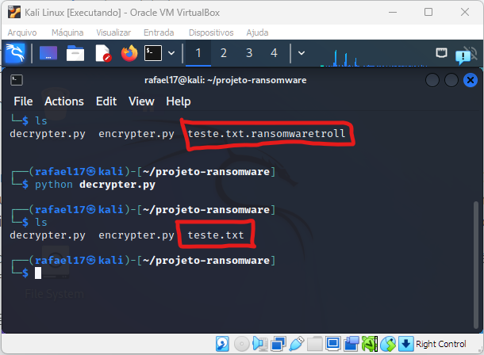
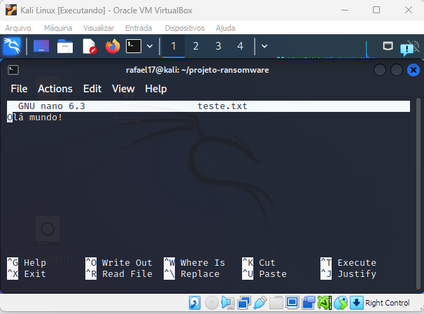

## Desafio de Projeto Ransomware

Nesse projeto usaremos apenas 02 arquivos:

* **encrypter.py:** Código que irá criptografar o arquivo
* **decrypter.py:** Código que irá descriptografar o arquivo

### Requisitos
- Python
- Módulo pyaes

### Comandos usados:
- `mkdir projeto-ransomware`: para criar a pasta do projeto
- `cd`: para ir até a pasta projeto-ransomware
- `touch teste.txt`: criar arquivo teste.txt
- `touch encrypter.py`: criar arquivo encrypter
- `touch decrypter.py`: criar arquivo decrypter
- `import os`: biblioteca
- `import pyaes`: biblioteca

### Instalação do módulo pyaes
Abra um terminal e execute o seguinte comando:
`pip install pyaes`

### Criptografia de arquivo
Execute o seguinte comando:
`python encrypter.py`

### Descriptografia de arquivo
Execute o seguinte comando:
`python decrypter.py`

### Imagens do processo de cryptografia e descriptografia

Arquivo criptografado:

Arquivo descriptografado:

Arquivo legível:

